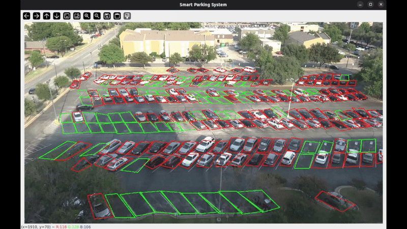

# Smart Parking Management System: Computer Vision & Occupancy Detection

## Project Description
This project focuses on **Real-Time Parking Occupancy Detection** using Computer Vision and Deep Learning. As a statistics student interested in computer vision, my goal was to build a robust system that combines deep learning detection with geometric algorithms, rather than relying on simple overlap checks.

The system detects vehicles in a video stream (CCTV/Drone view), maps them to pre-defined parking spots using a coordinate system, and determines occupancy status in real-time. It specifically addresses challenges related to **aerial view object detection**, **shadow occlusion**, and **low-contrast environments** using advanced image preprocessing techniques.



*(Fig 1: Final system output demonstrating real-time occupancy detection with shadow handling.)*

## Technical Implementation

### 1. The Logic: Polygon Mapping & Geometric Testing
Unlike simple bounding box intersection methods (IoU), this project utilizes the **Point-in-Polygon (PiP)** algorithm for higher precision in angled parking spots.

**Coordinate Mapping:**
First, a helper script (`picker.py`) is used to manually define the 4-point polygon coordinates for each parking space. These coordinates are serialized and stored using `pickle`.

**Decision Algorithm:**
To determine if a car is inside a spot, the system calculates the centroid of the detected vehicle bounding box:

$$
C_x = \frac{x_1 + x_2}{2}, \quad C_y = \frac{y_1 + y_2}{2}
$$

Then, it applies the **Ray Casting Algorithm** (via `cv2.pointPolygonTest`) to check if this centroid $(C_x, C_y)$ lies within the defined polygon.

* **Logic:** A ray is cast from the point to infinity. If it intersects the polygon's edges an odd number of times, the point is inside.
* **Thresholding:** The system only marks a spot as "Occupied" if the point is strictly inside (returning a positive value).

### 2. Vehicle Detection (VisDrone Adaptation)
Initially, standard YOLOv8 models (trained on COCO) were used. However, due to the **top-down (aerial) camera angle**, standard models struggled to differentiate vehicles from rectangular objects (like benches or dumpsters) and failed to detect cars in deep shadows.

**Solution:**
The model was switched to **YOLOv8m (Medium)** trained on the **VisDrone Dataset**.
* **Why VisDrone?** This dataset is specifically designed for drone-based / aerial imagery, making it significantly more accurate for detecting small vehicles and distinct vehicle classes (Car, Van, Truck, Bus) from a top-down perspective.
* **Class Filtering:** The system strictly filters for specific VisDrone class IDs (e.g., 3: Car, 4: Van, 5: Truck) to avoid false positives.

### 3. Handling Environmental Challenges (Image Preprocessing)
A major challenge in the dataset was **high-contrast shadows**, where dark vehicles on dark asphalt became invisible to the detection model. To solve this, a custom preprocessing pipeline was implemented before feeding frames to YOLO.

**A. Gamma Correction:**
To artificially brighten the dark regions without "washing out" the image, a non-linear Gamma correction is applied:

$$
V_{out} = V_{in}^{\gamma}
$$

* Where $\gamma < 1.0$ darkens and $\gamma > 1.0$ brightens the image. We used specific gamma values (e.g., 1.5 - 2.0) to reveal details in the shadows.

**B. CLAHE (Contrast Limited Adaptive Histogram Equalization):**
Standard histogram equalization causes noise amplification in flat regions. **CLAHE** operates on small tiles of the image, enhancing local contrast. This was the "nuclear option" used to separate black cars from black shadows.

```python
# Image Preprocessing Utilities (utils.py)
def apply_clahe(image, clip_limit=3.0, tile_grid_size=(8, 8)):
    # Convert to LAB color space to separate luminosity
    lab = cv2.cvtColor(image, cv2.COLOR_BGR2LAB)
    l, a, b = cv2.split(lab)
    
    # Apply CLAHE to L-channel
    clahe = cv2.createCLAHE(clipLimit=clip_limit, tileGridSize=tile_grid_size)
    cl = clahe.apply(l)
    
    # Merge and convert back
    limg = cv2.merge((cl, a, b))
    return cv2.cvtColor(limg, cv2.COLOR_LAB2BGR) 
```

## 5. Feature Improvements: Temporal Analysis & Data Logging

The next phase of this project moves beyond "instantaneous detection" to **long-term behavioral analysis**. The goal is to track the **Dwell Time** (duration of stay) for each vehicle to generate statistical insights about parking usage.

### A. Dwell Time Calculation Logic
To analyze how long a vehicle remains in a specific spot, a state-machine logic will be implemented:

1.  **State Change Detection:** The system monitors the boolean state of each polygon (Occupied/Empty).
2.  **Timestamping:**
    * When state flips **0 $\to$ 1** (Entry): Record $T_{start}$.
    * When state flips **1 $\to$ 0** (Exit): Record $T_{end}$.
3.  **Duration Formula:**
    $$\Delta t = T_{end} - T_{start}$$

This metric allows us to distinguish between "Pick-up/Drop-off" (short duration) and "Long-term Parking."

### B. Statistical Data Logging
As a statistics-driven project, raw detection data is valuable for analysis. A logging system will be integrated to export data to **CSV** or **SQL**:

| Spot_ID | Entry_Time | Exit_Time | Duration (min) | Vehicle_Type |
| :--- | :--- | :--- | :--- | :--- |
| A-01 | 14:02:15 | 14:45:10 | 42.9 | Car |
| B-05 | 14:10:00 | 14:12:30 | 2.5 | Truck |

### C. Heatmap Generation
Using the accumulated dwell time data, a **Heatmap Visualization** will be generated to visually represent:
* **High-Turnover Spots:** Spots that change vehicles frequently.
* **Dead Zones:** Spots that remain occupied for extended periods (or never used).